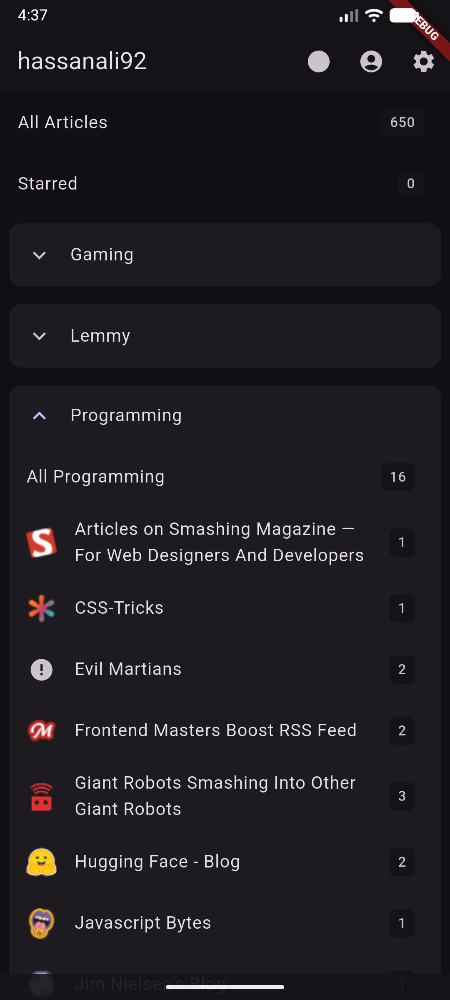

# FreshReader

An opinionated client for FreshRss (not affiliated) made just for me. but you can use it if you want

## Features
- [x] get unread articles from FreshRss Server
- [x] sync read articles to server
- [x] change the server link
- [x] filter by tag
- [x] filter by unread
- [X] search articles
- [x] render article as html
- [x] share article link
- [x] open in browser
- [x] in app browser view
- [x] show feed icon
- [x] add date separator in article list
- text formatting:
    - [x] save formatting options to storage
    - [x] font size
    - [x] word spacing
    - [x] line height

## Todo
- [ ] edit tags
- [ ] delete tags
- text formatting:
    - [ ] bionic reading

## Screenshots

